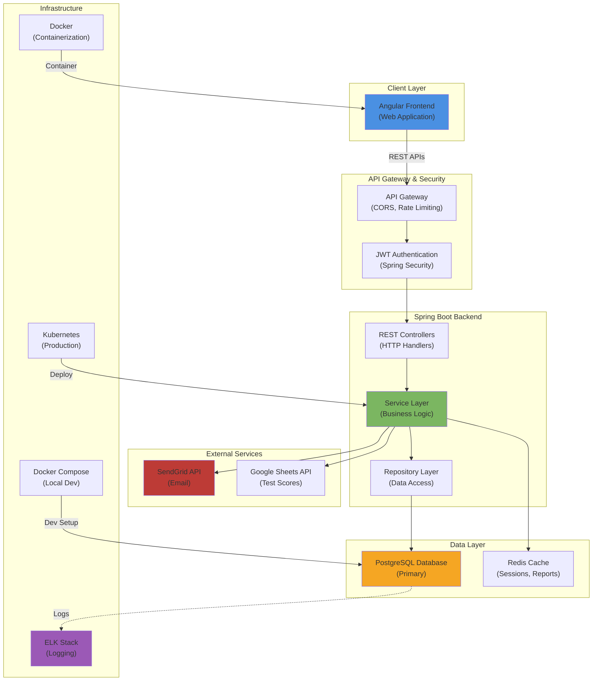
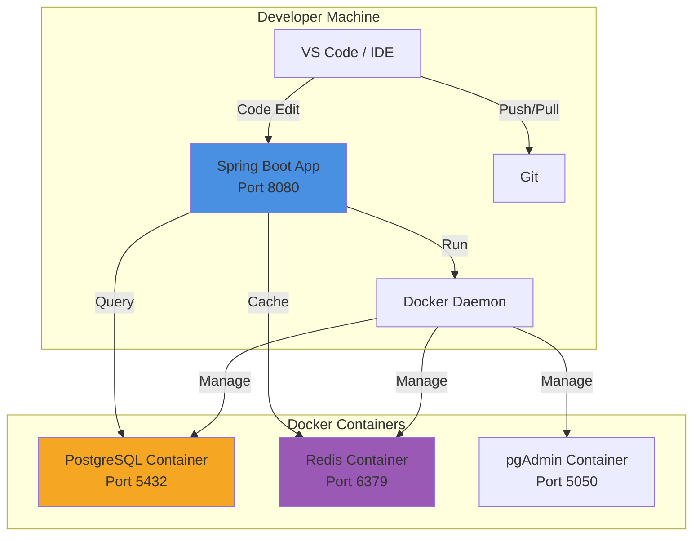
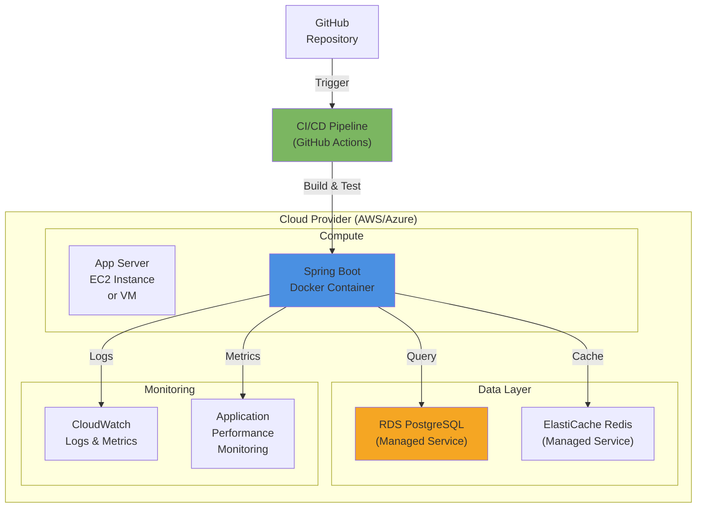
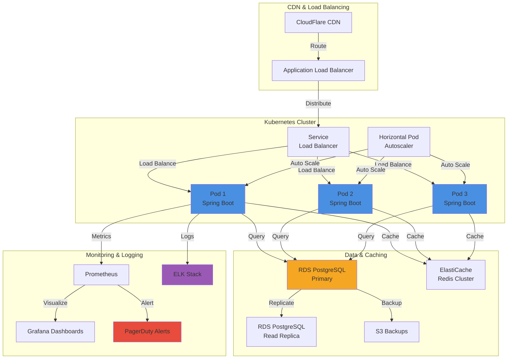

# System Architecture - Attendance Tracking System

## 1. Architectural Overview



---

## 2. Layered Architecture

### 2.1 Presentation Layer

**Responsibility:** Handle HTTP requests and responses

**Components:**
- REST Controllers
- Request/Response DTOs (Data Transfer Objects)
- Swagger/OpenAPI Documentation
- CORS Configuration

**Technologies:**
- Spring Boot Web
- Springdoc OpenAPI 2.0
- Spring Security

**Key Classes:**
```
com.attendance.controller/
├── AuthController.java
├── StudentController.java
├── AttendanceController.java
├── FeeController.java
├── ReportController.java
└── SubjectController.java
```

**Responsibilities:**
- Validate incoming requests using @Valid
- Handle HTTP methods (GET, POST, PUT, DELETE)
- Return appropriate HTTP status codes
- Delegate business logic to services

---

### 2.2 Application (Business Logic) Layer

**Responsibility:** Implement core business logic

**Components:**
- Service classes implementing business logic
- Domain validators
- Business rule enforcement
- Orchestration of repository operations

**Technologies:**
- Spring Service annotation
- Transaction management (@Transactional)
- Event publishing (ApplicationEventPublisher)

**Key Classes:**
```
com.attendance.service/
├── StudentService.java
├── AttendanceService.java
├── FeeService.java
├── ReportService.java
├── NotificationService.java
└── AuthenticationService.java
```

**Key Responsibilities:**
- Calculate attendance percentages
- Enforce business rules (fee validation, date checks)
- Publish domain events
- Coordinate multiple repositories
- Handle retries and error recovery

**Example Service Structure:**
```java
@Service
@Transactional
@RequiredArgsConstructor
public class StudentService {
    // Fields injected via constructor
    private final StudentRepository studentRepository;
    private final EnrollmentRepository enrollmentRepository;
    private final ApplicationEventPublisher eventPublisher;
    
    // Transactional methods for data consistency
    public StudentDTO createStudent(CreateStudentDTO dto) { }
    
    // Read-only methods for optimization
    @Transactional(readOnly = true)
    public StudentDTO getStudent(Long id) { }
}
```

---

### 2.3 Domain (Entity) Layer

**Responsibility:** Represent business domain objects

**Components:**
- JPA Entity classes
- Domain value objects
- Repository interfaces
- Domain specifications

**Technologies:**
- Hibernate/JPA
- Spring Data JPA
- Lombok annotations

**Key Classes:**
```
com.attendance.model/
├── User.java
├── Student.java
├── Teacher.java
├── Subject.java
├── Enrollment.java
├── Attendance.java
├── Fee.java
├── FeePayment.java
├── Report.java
└── Notification.java
```

**Entity Relationships:**
- User (1) → Student (0..1)
- Student (1) → Attendance (*)
- Student (1) → Enrollment (*)
- Enrollment (*) → Subject (1)
- Student (1) → Fee (*)
- Fee (1) → FeePayment (*)

---

### 2.4 Persistence (Data Access) Layer

**Responsibility:** Data access and query execution

**Components:**
- Repository interfaces extending JpaRepository
- Custom query methods
- Named queries
- Query specifications

**Technologies:**
- Spring Data JPA
- Hibernate
- PostgreSQL JDBC Driver

**Key Classes:**
```
com.attendance.repository/
├── UserRepository.java
├── StudentRepository.java
├── AttendanceRepository.java
├── FeeRepository.java
├── ReportRepository.java
├── SubjectRepository.java
└── EnrollmentRepository.java
```

**Repository Pattern Benefits:**
- Decouples business logic from database specifics
- Easy to mock in tests
- Consistent CRUD operations
- Built-in pagination and sorting

---

### 2.5 Infrastructure & Support Layer

**Responsibility:** Cross-cutting concerns and external integrations

**Components:**
- Email service (SendGrid integration)
- Caching (Redis)
- Logging (SLF4J + Logback)
- Configuration management
- Security filters

**Key Classes:**
```
com.attendance.config/
├── SecurityConfig.java
├── CorsConfig.java
├── DatabaseConfig.java
├── CacheConfig.java
└── ExceptionHandler.java

com.attendance.util/
├── EmailSender.java
├── GoogleSheetsClient.java
├── JwtTokenProvider.java
└── PasswordEncoder.java
```

---

## 3. Deployment Architecture

### 3.1 Local Development Environment



**Setup Command:**
```bash
# Start all services
docker-compose up -d

# Spring Boot app runs locally on http://localhost:8080
```

---

### 3.2 Staging Environment



**Deployment Process:**
```bash
# 1. Code push to GitHub
git push origin main

# 2. GitHub Actions triggered
# 3. Run tests: mvn clean test
# 4. Build Docker image
# 5. Push to container registry
# 6. Deploy to staging server
# 7. Run smoke tests
# 8. Alert on failures
```

---

### 3.3 Production Environment



**Production Features:**
- **High Availability:** 3+ pod replicas
- **Auto-scaling:** Based on CPU/Memory
- **Load Balancing:** Distributes traffic
- **Database Replication:** Read replicas for scaling
- **Backup & Disaster Recovery:** Daily backups
- **Monitoring:** Real-time metrics and alerts

---

## 4. Data Flow Diagrams

### 4.1 Request Processing Flow

```
1. Client Request (Angular)
   ↓
2. API Gateway (Spring Cloud Gateway)
   - Rate limiting
   - Request validation
   ↓
3. Authentication & Authorization
   - JWT validation
   - Role check
   ↓
4. Controller (REST Handler)
   - @Valid annotation validation
   - DTO binding
   ↓
5. Service Layer (Business Logic)
   - Business rule validation
   - Data processing
   - Event publishing
   ↓
6. Repository Layer (Data Access)
   - JPA query execution
   - Database transaction
   ↓
7. PostgreSQL Database
   - ACID compliance
   - Referential integrity check
   ↓
8. Response to Client
   - DTO serialization
   - HTTP status code
   - Headers (CORS, Cache-Control)
```

---

### 4.2 Authentication Flow

```
User Login
   ↓
POST /api/v1/auth/login
   ↓
AuthenticationService
   - Hash password check (bcrypt)
   - User lookup
   ↓
JwtTokenProvider
   - Generate access token (exp: 1 hour)
   - Generate refresh token (exp: 7 days)
   ↓
Return {accessToken, refreshToken}
   ↓
Client stores in localStorage
   ↓
Subsequent Requests
   - Include: Authorization: Bearer {token}
   ↓
JWT Filter validates token
   ↓
Spring Security context set with user details
```

---

## 5. Technology Stack Justification

### Backend Framework: Spring Boot 3.x

**Why Spring Boot:**
- ✅ Fastest path to production-ready applications
- ✅ Comprehensive ecosystem (Spring Data, Security, Cloud)
- ✅ Excellent testing support
- ✅ Community and industry adoption
- ✅ 5+ years LTS support

**Key Spring Boot Features Used:**
- Spring Web MVC (REST)
- Spring Data JPA (ORM)
- Spring Security (Auth)
- Spring Boot Actuator (Health checks)

---

### Database: PostgreSQL

**Why PostgreSQL:**
- ✅ ACID compliance (data consistency)
- ✅ Complex queries with JOINs (referential integrity)
- ✅ JSON data type support
- ✅ Excellent indexing capabilities
- ✅ Free and open source
- ✅ Scales to billions of records

**Key Features Used:**
- JSONB columns (metadata)
- Partial indexes (for optimization)
- Computed columns (for efficiency)
- Full-text search (future)

---

### ORM: Hibernate/JPA

**Why Hibernate:**
- ✅ Standard Java ORM specification
- ✅ Lazy loading and relationship management
- ✅ Query optimization with HQL
- ✅ Caching support (L1 & L2)
- ✅ Seamless Spring Data integration

---

### API Documentation: Springdoc OpenAPI

**Why Springdoc:**
- ✅ Auto-generates OpenAPI 3.0 specification
- ✅ Interactive Swagger UI
- ✅ Zero configuration needed
- ✅ Better than Springfox (active development)

---

### Security: Spring Security 6.x

**Why Spring Security:**
- ✅ Industry standard authentication/authorization
- ✅ JWT support out of the box
- ✅ OAuth2 and SAML support
- ✅ CORS handling
- ✅ CSRF protection

---

### Caching: Redis

**Why Redis:**
- ✅ In-memory data structure store
- ✅ Sub-millisecond latency
- ✅ Supports complex data types
- ✅ High throughput (1M+ ops/sec)
- ✅ Perfect for sessions and reports

**Cache Strategy:**
- Session data (1 hour TTL)
- Monthly reports (30 days TTL)
- Subject list (permanent until update)

---

### Email Service: SendGrid

**Why SendGrid:**
- ✅ 99.95% uptime SLA
- ✅ 100k emails/month free tier
- ✅ REST API easy integration
- ✅ Webhook support for delivery tracking
- ✅ Analytics and reporting

---

## 6. Scalability Architecture

### Horizontal Scaling

```
Load Balancer
    ↓
┌───────────┬───────────┬───────────┐
│ Pod 1     │ Pod 2     │ Pod 3     │
│ Spring    │ Spring    │ Spring    │
│ Port 8080 │ Port 8080 │ Port 8080 │
└───────────┴───────────┴───────────┘
         ↓       ↓       ↓
    ┌──────────────────────┐
    │  Single PostgreSQL   │
    │   Primary Instance   │
    └──────────────────────┘
         ↓       ↓
    ┌──────┐ ┌──────┐
    │Read  │ │Read  │
    │Rep-1 │ │Rep-2 │
    └──────┘ └──────┘
```

**Scaling Layers:**
1. **Application Pods:** Horizontal (1→3→N)
2. **Database:** Vertical + Read Replicas
3. **Cache:** Redis Cluster (sharded)
4. **Messaging:** Event bus (async processing)

---

### Performance Optimization

**Query Optimization:**
```sql
-- Bad: N+1 queries
List<Student> students = studentRepo.findAll();
for(Student s : students) {
    s.getEnrollments().size();  // N queries
}

-- Good: Eager loading
@Query("SELECT DISTINCT s FROM Student s LEFT JOIN FETCH s.enrollments")
List<Student> findAllWithEnrollments();

-- Best: Projection DTO
@Query("SELECT NEW com.attendance.dto.StudentDTO(s.id, s.firstName) FROM Student s")
List<StudentDTO> findAllProjection();
```

**Caching Strategy:**
```java
@Cacheable(value = "students", key = "#id", unless = "#result == null")
public StudentDTO getStudent(Long id) { }

@CacheEvict(value = "students", allEntries = true)
@CacheEvict(value = "reports", allEntries = true)
public void updateStudent(Long id, UpdateDTO dto) { }
```

**Indexing:**
```sql
-- Multi-column index for most common query
CREATE INDEX idx_att_student_date ON attendance(student_id, date DESC);

-- Partial index for outstanding fees
CREATE INDEX idx_fees_outstanding ON fees(outstanding_amount) 
    WHERE status = 'OUTSTANDING';
```

---

## 7. Disaster Recovery & Backup

### Recovery Time Objectives (RTO) & Recovery Point Objectives (RPO)

| Scenario | RTO | RPO | Strategy |
|----------|-----|-----|----------|
| Database failure | 30 min | 5 min | Read replicas + failover |
| App server crash | 5 min | 0 min | Auto-restart + health check |
| Data corruption | 4 hours | Daily | Point-in-time restore |
| Full site failure | 2 hours | 30 min | Multi-region failover |

### Backup Strategy

```
Daily Full Backup (2 AM)
   ↓
Upload to S3 (encrypted)
   ↓
Incremental Backups (every 6 hours)
   ↓
Point-in-time recovery window: 35 days
   ↓
Test restore monthly
```

---

## 8. Security Architecture

### Defense in Depth

```
Layer 1: Network
┌──────────────────────────────────────┐
│ WAF (Web Application Firewall)       │
│ DDoS Protection                      │
│ Rate Limiting                        │
└──────────────────────────────────────┘
            ↓
Layer 2: Application
┌──────────────────────────────────────┐
│ HTTPS/TLS 1.3                        │
│ CORS Policy                          │
│ Input Validation                     │
│ SQL Injection Prevention (Parameterized)
└──────────────────────────────────────┘
            ↓
Layer 3: Authentication & Authorization
┌──────────────────────────────────────┐
│ JWT Token + Refresh Token            │
│ Role-Based Access Control (RBAC)     │
│ Fine-grained Permissions             │
└──────────────────────────────────────┘
            ↓
Layer 4: Data
┌──────────────────────────────────────┐
│ Encryption at Rest (AES-256)         │
│ Encryption in Transit (TLS)          │
│ Column-level Encryption (sensitive)  │
│ Audit Logging                        │
└──────────────────────────────────────┘
```

---

## 9. Monitoring & Observability

### Metrics to Monitor

**Application Metrics:**
- Request rate (req/sec)
- Response time (p50, p95, p99)
- Error rate (errors/sec)
- Cache hit ratio (%)

**Database Metrics:**
- Query time (avg, max)
- Connections (active/total)
- Lock wait time
- Replication lag (seconds)

**Infrastructure Metrics:**
- CPU usage (%)
- Memory usage (%)
- Disk I/O (IOPS)
- Network bandwidth (Mbps)

### Logging Strategy

```
Application Logs → Filebeat → ELK Stack → Visualization
                ↓
          JSON format
          Structured logging
          Correlation IDs
          
Error Logs → PagerDuty → On-call Engineer
Alert Thresholds:
- Error rate > 1%
- Response time p95 > 500ms
- Database replication lag > 10s
- Pod restart rate > 3/hour
```

---

## 10. Future Scalability Considerations

### Phase 2 Enhancements

1. **Event Streaming:** Kafka for async processing
2. **Microservices:** Split into domain services
3. **GraphQL:** Alternative to REST API
4. **Mobile App:** Native iOS/Android apps
5. **Real-time Notifications:** WebSocket support
6. **Analytics:** ElasticSearch + Kibana

### Technology Evolution Path

```
Current (Monolith)
   ↓ (Year 1)
Service-oriented (Spring Cloud)
   ↓ (Year 2)
Microservices (Kubernetes)
   ↓ (Year 3)
Serverless functions (for scheduled tasks)
```

---

**Document Version:** 1.0  
**Last Updated:** 2026-06-15  
**Architecture Status:** Design Approved ✅
