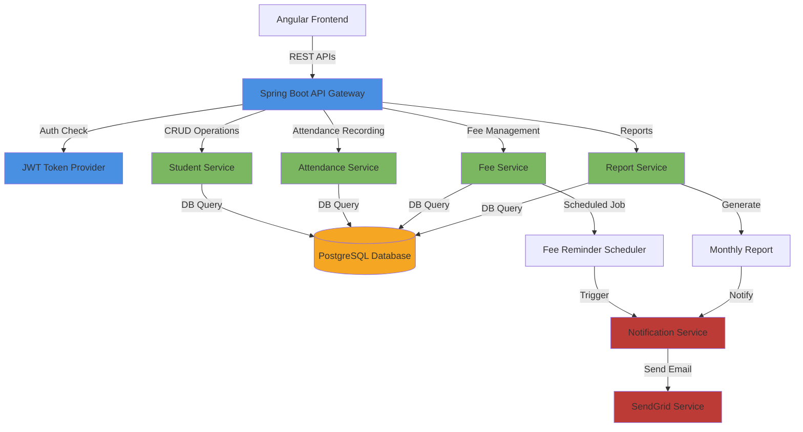
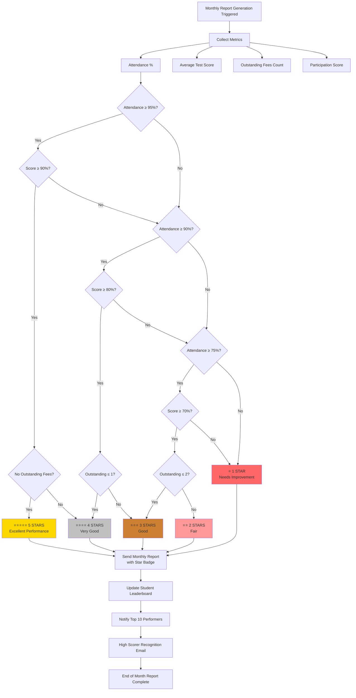
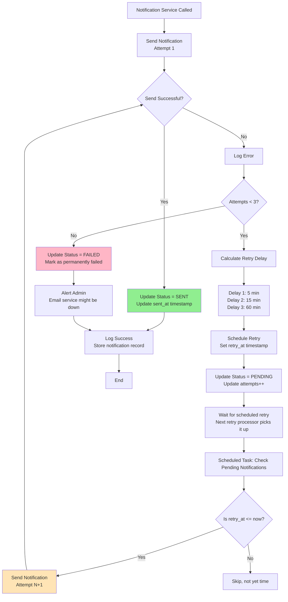
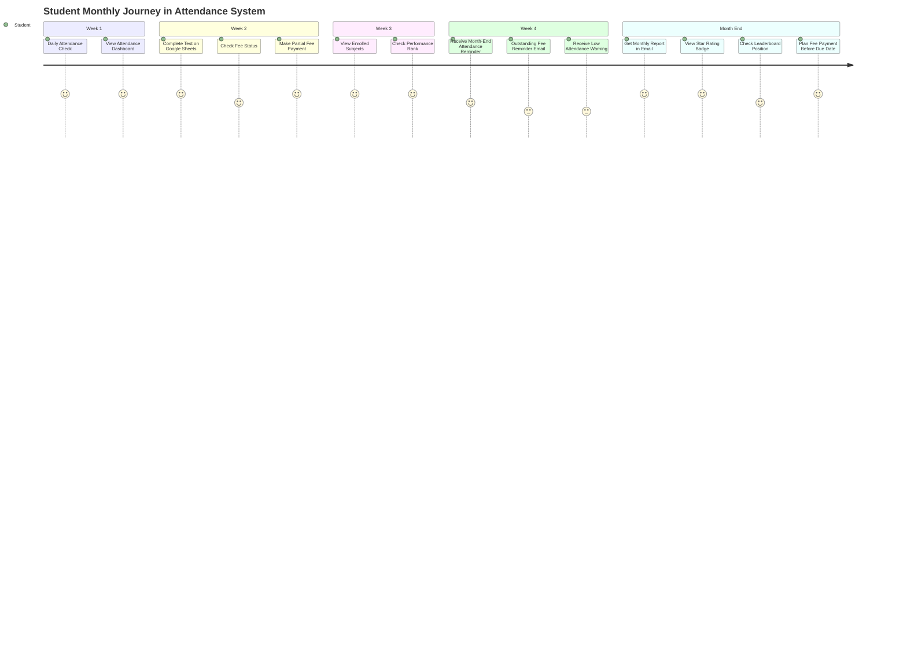

# Flow Diagrams - Attendance Tracking System

## 1. System Overview - Component Interaction Diagram



---

## 2. Authentication & Authorization Flow

```mermaid
sequenceDiagram
    actor User
    participant Frontend as Angular Frontend
    participant Auth as Auth Controller
    participant AuthSvc as Authentication Service
    participant UserRepo as User Repository
    participant JwtProvider as JWT Provider
    participant DB as PostgreSQL

    User->>Frontend: Enter Email & Password
    Frontend->>Auth: POST /api/v1/auth/login
    Auth->>AuthSvc: authenticate(email, password)
    AuthSvc->>UserRepo: findByEmail(email)
    UserRepo->>DB: SELECT * FROM users WHERE email = ?
    DB-->>UserRepo: User Entity
    UserRepo-->>AuthSvc: User Entity
    
    alt User not found
        AuthSvc-->>Auth: UserNotFoundException
        Auth-->>Frontend: 401 Unauthorized
        Frontend-->>User: Invalid email/password
    else Password mismatch
        AuthSvc-->>Auth: InvalidCredentialsException
        Auth-->>Frontend: 401 Unauthorized
        Frontend-->>User: Invalid email/password
    else Credentials valid
        AuthSvc->>JwtProvider: generateToken(user)
        JwtProvider->>JwtProvider: Sign token with secret
        JwtProvider-->>AuthSvc: Access Token
        AuthSvc->>JwtProvider: generateRefreshToken(user)
        JwtProvider-->>AuthSvc: Refresh Token
        AuthSvc-->>Auth: JwtResponse
        Auth-->>Frontend: {accessToken, refreshToken}
        Frontend->>Frontend: Store tokens in localStorage
        Frontend-->>User: Login successful
        Note over Frontend: Include accessToken in Authorization header
        User->>Frontend: Request student data
        Frontend->>Auth: GET /api/v1/students?Authorization: Bearer token
        Auth->>AuthSvc: validateToken(token)
        AuthSvc->>JwtProvider: validateToken(token)
        JwtProvider-->>AuthSvc: Valid / Expired / Invalid
        AuthSvc-->>Auth: User Details
        Auth-->>Frontend: Student Data (200 OK)
    end

    note over Frontend,DB
        Access Token: Valid for 1 hour
        Refresh Token: Valid for 7 days
        Tokens: JWT format signed with HS256
    end
```

**Key Points:**
- Password hashed with bcrypt (min 12 rounds)
- JWT tokens include: user ID, email, roles, exp
- Refresh token rotation on use
- Access denied for expired tokens

---

## 3. Attendance Marking Flow

```mermaid
sequenceDiagram
    participant Teacher as Teacher (Web UI)
    participant AttendCtrl as Attendance Controller
    participant AttendSvc as Attendance Service
    participant StudentRepo as Student Repository
    participant AttendRepo as Attendance Repository
    participant EventPub as Event Publisher
    participant NotifSvc as Notification Service
    participant EmailSvc as Email Service
    participant DB as PostgreSQL

    Teacher->>AttendCtrl: POST /api/v1/attendance/mark
    Note over AttendCtrl: Request: {studentId, date, status}
    AttendCtrl->>AttendSvc: markAttendance(markAttendanceDTO)
    
    AttendSvc->>StudentRepo: findById(studentId)
    StudentRepo->>DB: SELECT * FROM students WHERE id = ?
    DB-->>StudentRepo: Student Entity / Null
    
    alt Student not found
        StudentRepo-->>AttendSvc: Optional.empty()
        AttendSvc-->>AttendCtrl: StudentNotFoundException
        AttendCtrl-->>Teacher: 404 Not Found
    else Student found
        StudentRepo-->>AttendSvc: Student Entity
        AttendSvc->>AttendSvc: Validate date not in future
        alt Date is in future
            AttendSvc-->>AttendCtrl: InvalidAttendanceDateException
            AttendCtrl-->>Teacher: 400 Bad Request
        else Date is valid
            AttendSvc->>AttendSvc: Create Attendance record
            AttendSvc->>AttendRepo: save(attendance)
            AttendRepo->>DB: INSERT INTO attendance(...)
            DB-->>AttendRepo: Saved Attendance ID
            AttendRepo-->>AttendSvc: Attendance Entity
            
            AttendSvc->>EventPub: publishEvent(AttendanceMarkedEvent)
            EventPub->>AttendSvc: Event published
            
            AttendSvc->>AttendSvc: checkAttendanceThreshold(student)
            Note over AttendSvc: Calculate monthly attendance %
            
            alt Attendance < 75%
                AttendSvc->>NotifSvc: sendNotification(lowAttendanceNotif)
                NotifSvc->>EmailSvc: sendEmail(student.email)
                Note over EmailSvc: "Your attendance is 70%. Please improve!"
                EmailSvc-->>NotifSvc: Email sent
            end
            
            AttendSvc-->>AttendCtrl: Saved AttendanceDTO
            AttendCtrl-->>Teacher: 200 OK + Attendance Details
            Teacher->>Teacher: Show success message
            Note over Teacher: "Attendance marked successfully"
        end
    end

    note over AttendSvc,EmailSvc
        Low Attendance Threshold: 75%
        Email only if < 75% in current month
        Event-driven design allows easy addition of SMS/Push
    end
```

**Business Logic:**
- Validate student exists
- Prevent future date entries
- Calculate monthly attendance on marking
- Send notification if below 75%

---

## 4. Fee Payment & Reminder Flow

```mermaid
sequenceDiagram
    participant Student as Student
    participant Frontend as Frontend (Payment Page)
    participant FeeCtrl as Fee Controller
    participant FeeSvc as Fee Service
    participant FeeRepo as Fee Repository
    participant PaymentRepo as Payment Repository
    participant Scheduler as Scheduled Task (Daily 8 AM)
    participant NotifSvc as Notification Service
    participant EmailSvc as SendGrid Email Service
    participant DB as PostgreSQL

    rect rgba(200, 230, 255, 0.5)
        Note over Student,DB: Payment Recording Flow
        Student->>Frontend: Select fee & enter amount
        Frontend->>FeeCtrl: POST /api/v1/fees/payment
        Note over FeeCtrl: Request: {feeId, amount, paymentMethod}
        
        FeeCtrl->>FeeSvc: recordPayment(paymentDTO)
        
        FeeSvc->>FeeRepo: findById(feeId)
        FeeRepo->>DB: SELECT * FROM fees WHERE id = ?
        DB-->>FeeRepo: Fee Entity
        FeeRepo-->>FeeSvc: Fee Entity
        
        alt Fee not found
            FeeSvc-->>FeeCtrl: FeeNotFoundException
            FeeCtrl-->>Frontend: 404 Not Found
        else Fee found
            FeeSvc->>FeeSvc: Validate amount > 0
            alt Amount invalid
                FeeSvc-->>FeeCtrl: InvalidPaymentException
                FeeCtrl-->>Frontend: 400 Bad Request
            else Amount valid
                FeeSvc->>PaymentRepo: save(feePayment)
                PaymentRepo->>DB: INSERT INTO fee_payments(...)
                DB-->>PaymentRepo: Payment ID
                
                FeeSvc->>FeeSvc: Calculate new outstanding
                Note over FeeSvc: outstanding = outstanding - amount
                
                alt Outstanding <= 0
                    FeeSvc->>FeeSvc: Set status = PAID
                else Outstanding > 0
                    FeeSvc->>FeeSvc: Set status = PARTIAL
                end
                
                FeeSvc->>FeeRepo: save(updatedFee)
                FeeRepo->>DB: UPDATE fees SET outstanding_amount = ?
                DB-->>FeeRepo: Updated
                
                FeeSvc-->>FeeCtrl: FeePaymentDTO
                FeeCtrl-->>Frontend: 200 OK + Receipt
                Frontend-->>Student: Payment successful ✓
            end
        end
    end

    rect rgba(255, 200, 200, 0.5)
        Note over Scheduler,DB: Fee Reminder Flow (Scheduled Daily)
        Scheduler->>FeeSvc: sendOutstandingFeeReminders()
        FeeSvc->>FeeRepo: findByStatusAndDueDateBefore(OUTSTANDING, today-5)
        FeeRepo->>DB: SELECT * FROM fees WHERE status='OUTSTANDING' AND due_date < ?
        DB-->>FeeRepo: List of overdue fees
        FeeRepo-->>FeeSvc: Overdue fee list
        
        loop For each overdue fee
            FeeSvc->>NotifSvc: sendNotification(feeReminderNotif)
            NotifSvc->>EmailSvc: sendEmail()
            Note over EmailSvc: Subject: "Outstanding Fee Reminder"<br/>Body: "You have Rs. 5000 outstanding.<br/>Please pay within 2 days."
            EmailSvc-->>NotifSvc: Email queued in SendGrid
        end
        
        FeeSvc-->>Scheduler: Reminders sent (1200 emails)
        Scheduler->>Scheduler: Log completion
    end

    note over FeeSvc
        Reminder sent if:
        - Status = OUTSTANDING
        - Due date is 5+ days past
        - Runs daily at 8 AM via @Scheduled
        - Uses SendGrid for reliable delivery
    end
```

**Key Features:**
- Payment validation and recording
- Automatic status update (OUTSTANDING → PARTIAL → PAID)
- Daily scheduled reminder for overdue fees
- Email sent 5+ days after due date

---

## 5. Monthly Report Generation & Send Flow

```mermaid
sequenceDiagram
    participant Scheduler as Scheduled Task<br/>11 PM Last Day of Month
    participant ReportSvc as Report Service
    participant StudentRepo as Student Repository
    participant AttendRepo as Attendance Repository
    participant FeeRepo as Fee Repository
    participant GoogleAPI as Google Sheets API
    participant NotifSvc as Notification Service
    participant EmailSvc as SendGrid Service
    participant DB as PostgreSQL

    Scheduler->>ReportSvc: sendMonthlyReport(studentId) or sendAllMonthlyReports()
    
    ReportSvc->>StudentRepo: findAllActive() or findById(studentId)
    StudentRepo->>DB: SELECT * FROM students WHERE enrollment_status='ACTIVE'
    DB-->>StudentRepo: List of students
    StudentRepo-->>ReportSvc: Student list
    
    loop For each student
        ReportSvc->>ReportSvc: generateMonthlyReport(studentId, month)
        
        rect rgba(100, 150, 200, 0.3)
            Note over ReportSvc: Calculate Attendance
            ReportSvc->>AttendRepo: findByStudentAndDateBetween(studentId, month_start, month_end)
            AttendRepo->>DB: SELECT COUNT(*) FROM attendance WHERE student_id=? AND date BETWEEN ? AND ?
            DB-->>AttendRepo: Present/Absent/Leave counts
            AttendRepo-->>ReportSvc: Counts
            ReportSvc->>ReportSvc: Attendance% = (Present/Total)*100
        end
        
        rect rgba(100, 150, 200, 0.3)
            Note over ReportSvc: Get Test Scores
            ReportSvc->>GoogleAPI: GET /sheets/{sheetId}?range=StudentScores
            Note over GoogleAPI: student.googleDocLink contains sheet ID & range
            GoogleAPI-->>ReportSvc: Test scores for month
            ReportSvc->>ReportSvc: Calculate average score
        end
        
        rect rgba(100, 150, 200, 0.3)
            Note over ReportSvc: Get Fee Status
            ReportSvc->>FeeRepo: findByStudentAndStatus(studentId, OUTSTANDING)
            FeeRepo->>DB: SELECT * FROM fees WHERE student_id=? AND status='OUTSTANDING'
            DB-->>FeeRepo: Outstanding fees list
            FeeRepo-->>ReportSvc: Count of outstanding fees
        end
        
        rect rgba(150, 200, 100, 0.3)
            Note over ReportSvc: Calculate Star Rating
            ReportSvc->>ReportSvc: calculateStarRating(attendance%, score, outstanding_count)
            Note over ReportSvc: 5 Stars: Attend≥95% & Score≥90% & No outstanding<br/>4 Stars: Attend≥90% & Score≥80% & ≤1 outstanding<br/>3 Stars: Attend≥75% & Score≥70% & ≤2 outstanding<br/>2 Stars: Attend≥75% & Score≥60%<br/>1 Star: Below thresholds
        end
        
        rect rgba(150, 200, 100, 0.3)
            Note over ReportSvc: Get Performance Rank
            ReportSvc->>ReportSvc: getPerformanceRank(studentId, score)
            Note over ReportSvc: Rank among peers in same standard/board
            ReportSvc->>ReportSvc: Select appropriate star icon URL
        end
        
        ReportSvc->>ReportSvc: Build MonthlyReportDTO
        Note over ReportSvc: {studentId, month, attendance%, scores, avg_score, outstanding_fees, star_rating, rank}
        
        ReportSvc->>NotifSvc: sendNotification(reportNotif)
        NotifSvc->>EmailSvc: sendEmail(student.email)
        
        Note over EmailSvc: HTML Email with:<br/>- Attendance Chart<br/>- Test Scores Table<br/>- Fee Status<br/>- Star Rating Badge<br/>- Leaderboard Position
        
        EmailSvc-->>NotifSvc: Email accepted by SendGrid
        NotifSvc-->>ReportSvc: Notification logged
    end
    
    Scheduler->>Scheduler: Log: "Monthly reports sent to 1000 students"

    note over ReportSvc
        Execution: Last day of month at 11 PM
        Report includes:
        1. Attendance percentage for month
        2. Test scores from Google Sheets
        3. Outstanding fees count
        4. Star rating (1-5)
        5. Performance rank in class
        All via single HTML email
    end
```

**Report Contents:**
- Attendance %: Calculated from daily records
- Test Scores: Fetched from Google Sheets
- Fee Status: Count of outstanding fees
- Star Rating: 1-5 based on composite metrics
- Performance Rank: Position in class rankings

---

## 6. Gamification - Star Rating Calculation Flow



**Star Criteria:**
- **5 Stars:** Attendance ≥95% + Score ≥90% + No outstanding fees
- **4 Stars:** Attendance ≥90% + Score ≥80% + Max 1 outstanding fee
- **3 Stars:** Attendance ≥75% + Score ≥70% + Max 2 outstanding fees
- **2 Stars:** Attendance ≥75% + Score ≥60%
- **1 Star:** Below thresholds

---

## 7. Error Handling & Recovery Flow

```mermaid
sequenceDiagram
    participant Client as REST Client
    participant Controller as API Controller
    participant Service as Business Service
    participant Validator as Validator
    participant Handler as Global Exception Handler
    participant Logger as Logger
    participant Response as Response

    Client->>Controller: Invalid Request (e.g., null studentId)
    
    Controller->>Validator: Validate @Valid annotations
    alt Validation fails
        Validator-->>Handler: MethodArgumentNotValidException
        Handler->>Logger: ERROR: Validation failed
        Handler->>Response: 400 Bad Request
        Response-->>Client: {code: "VALIDATION_ERROR", fieldErrors: [...]}
    end
    
    Controller->>Service: execute()
    alt Resource not found
        Service-->>Handler: StudentNotFoundException
        Handler->>Logger: ERROR: Student not found (ID: 123)
        Handler->>Response: 404 Not Found
        Response-->>Client: {code: "STU_001", message: "Student not found"}
    end
    
    alt Business logic violation
        Service-->>Handler: InvalidPaymentException
        Handler->>Logger: ERROR: Invalid payment amount (-500)
        Handler->>Response: 400 Bad Request
        Response-->>Client: {code: "FEE_001", message: "Payment amount must be positive"}
    end
    
    alt Access denied
        Service-->>Handler: AccessDeniedException
        Handler->>Logger: WARN: Unauthorized access by user 123
        Handler->>Response: 403 Forbidden
        Response-->>Client: {code: "AUTH_003", message: "Access denied"}
    end
    
    alt External service failure
        Service->>Service: Call Email Service
        Service-->>Handler: EmailServiceException (timeout)
        Handler->>Logger: ERROR: Email service timeout (retry: 1/3)
        Handler->>Response: 503 Service Unavailable
        Response-->>Client: {code: "SVC_001", message: "Service temporarily unavailable"}
        Note over Service: Retry scheduled for 5 min later
    end
    
    alt Success
        Service-->>Controller: Result
        Controller->>Response: 200 OK
        Response-->>Client: {status: 200, data: {...}, timestamp: 1623456789}
    end

    note over Logger
        All errors logged with:
        - Timestamp
        - User ID
        - Request path
        - Full stack trace
        - Recovery action
    end
```

**Error Response Format:**
```json
{
  "status": 400,
  "code": "VAL_001",
  "message": "Validation failed",
  "details": "Field 'amount' must be positive",
  "fieldErrors": [
    {
      "field": "amount",
      "value": "-500",
      "message": "Payment amount must be positive"
    }
  ],
  "timestamp": 1623456789,
  "path": "/api/v1/fees/payment"
}
```

---

## 8. Enrollment & Subject Management Flow

```mermaid
sequenceDiagram
    participant Admin as Admin/Teacher
    participant Frontend as Frontend
    participant EnrollCtrl as Enrollment Controller
    participant EnrollSvc as Enrollment Service
    participant StudentRepo as Student Repository
    participant SubjectRepo as Subject Repository
    participant EnrollRepo as Enrollment Repository
    participant DB as PostgreSQL

    Admin->>Frontend: View enrollment page
    Frontend->>EnrollCtrl: GET /api/v1/subjects
    EnrollCtrl->>EnrollSvc: getAllSubjects()
    EnrollSvc->>SubjectRepo: findAll()
    SubjectRepo->>DB: SELECT * FROM subjects
    DB-->>SubjectRepo: Subject list
    SubjectRepo-->>EnrollSvc: {Physics, Chemistry, Biology, ...}
    EnrollSvc-->>EnrollCtrl: Subject DTOs
    EnrollCtrl-->>Frontend: [Subject list with board/standard]
    Frontend->>Admin: Display subject options
    
    Admin->>Frontend: Select student & enroll in Physics (CBSE, Class 10)
    Frontend->>EnrollCtrl: POST /api/v1/enrollments
    Note over EnrollCtrl: {studentId: 5, subjectId: 1, board: "CBSE", standard: 10}
    
    EnrollCtrl->>EnrollSvc: enrollStudentInSubject(enrollmentDTO)
    EnrollSvc->>StudentRepo: findById(5)
    StudentRepo->>DB: SELECT * FROM students WHERE id=5
    DB-->>StudentRepo: Student entity
    StudentRepo-->>EnrollSvc: Student
    
    EnrollSvc->>SubjectRepo: findById(1)
    SubjectRepo->>DB: SELECT * FROM subjects WHERE id=1
    DB-->>SubjectRepo: Subject entity
    SubjectRepo-->>EnrollSvc: Subject (Physics)
    
    EnrollSvc->>EnrollSvc: Validate board matches student's board
    alt Board mismatch
        EnrollSvc-->>EnrollCtrl: InvalidEnrollmentException
        EnrollCtrl-->>Frontend: 400 Board mismatch error
    else Valid enrollment
        EnrollSvc->>EnrollRepo: save(enrollment)
        EnrollRepo->>DB: INSERT INTO enrollments(...)
        DB-->>EnrollRepo: Enrollment ID
        
        EnrollSvc-->>EnrollCtrl: EnrollmentDTO
        EnrollCtrl-->>Frontend: 201 Created
        Frontend->>Admin: Enrollment successful ✓
    end

    note over EnrollSvc
        Enrollment Validation:
        - Student board matches subject board
        - No duplicate enrollment
        - Student is in correct standard
        - Subject is active
    end
```

**Enrollment States:**
- **ACTIVE:** Currently enrolled
- **INACTIVE:** Dropped the subject
- **COMPLETED:** Course finished

---

## 9. Notification Retry & Failure Handling Flow



**Retry Logic:**
- Attempt 1: Immediate
- Attempt 2: 5 minutes later (exponential backoff)
- Attempt 3: 15 minutes later
- Attempt 4: 60 minutes later
- Max 3 retries, then permanently failed

---

## 10. Complete User Journey - Student Path



---

## Summary of Key Flows

| Flow | Trigger | Key Steps | Output |
|------|---------|-----------|--------|
| **Authentication** | User login | Verify credentials → Generate JWT → Return token | Access token + Refresh token |
| **Attendance Marking** | Teacher records attendance | Validate → Save → Check threshold → Notify | Saved record + Low attendance warning |
| **Fee Payment** | Student pays fee | Validate amount → Update outstanding → Check status | Payment receipt + Email confirmation |
| **Fee Reminder** | Scheduled daily 8 AM | Query overdue fees → Generate message → Send email | Reminder email to students |
| **Monthly Report** | Scheduled last day 11 PM | Aggregate metrics → Calculate stars → Send email | Comprehensive monthly report |
| **Star Rating** | During report generation | Evaluate 5 metrics → Apply criteria → Assign stars | 1-5 star rating |
| **Error Handling** | Any operation fails | Log error → Create response → Schedule retry | Error response + Notification |

**Document Version:** 1.0  
**Last Updated:** 2026-06-15
